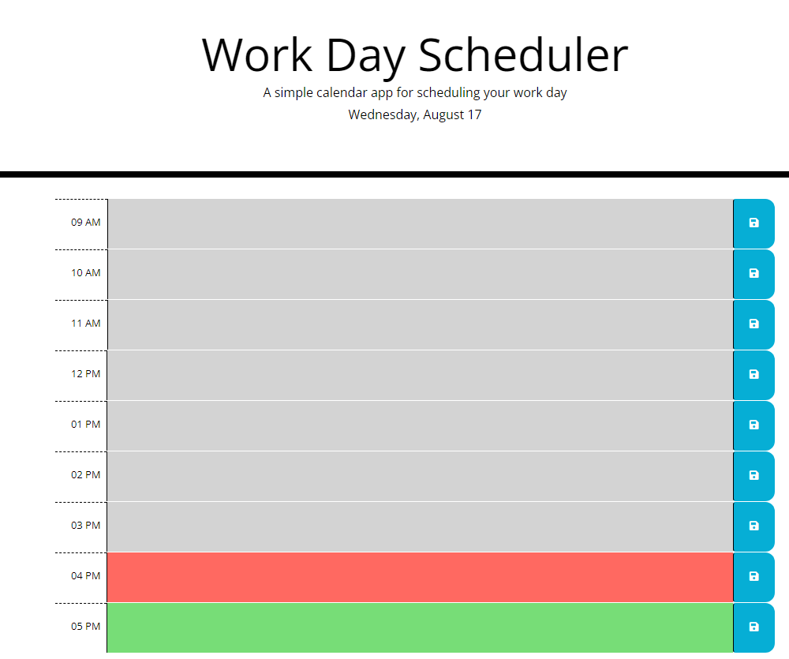

# Work day scheduler [](https://opensource.org/licenses/MIT)
  

## Description
Schedule your working day by typing in the allotted time slots and save each hour for each day. Each hour is colour coded. Grey being past hours, red is the current hour and green is the future hours. The app is deployed at https://seangenge.github.io/Work-day-scheduler/

## Table of Contents
- [Installation](#installation)
  
- [Usage](#usage)
  
- [License](#license)
  
- [Questions](#questions)



## Installation
To install the necessary dependencies, run the following command:
```
  npm i
```

## License
This project is licensed under the [MIT](https://opensource.org/licenses/MIT) license

## Questions
If you have any questions about the repo, open an issue or contact me directly at seangenge@gmail.com. You can find more of my work at [seangenge](https://github.com/seangenge).
